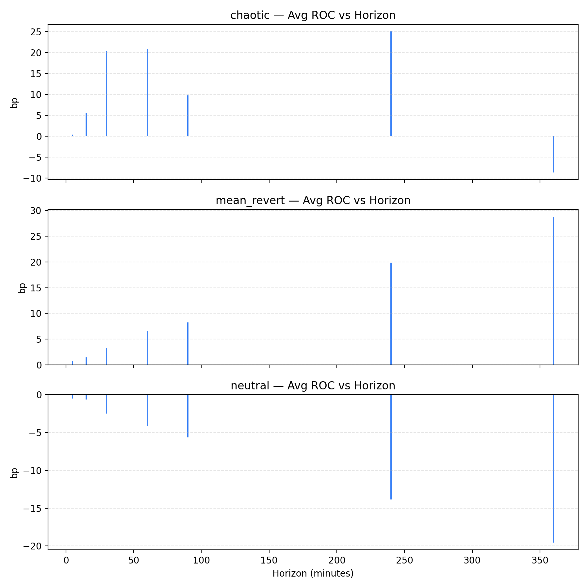
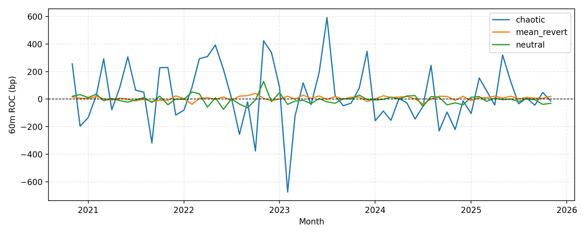

# Longitudinal ROC Study (Nov 2020 – Nov 2025)

## 1. Scope & method
- **Data window:** 288 weekly ROC summaries (**13 Nov 2020 → 11 Nov 2025**) created by replaying `scripts/tools/backfill_gate_history.py` for each week and exporting both JSONL fact tables and `roc_summary_*.json` payloads under `docs/evidence/roc_history/`.
- **Processing pipeline:**
  ```bash
  .venv/bin/python scripts/research/roc_longitudinal_summary.py --start 2020-11-13 --end 2025-11-11 --roc-dir docs/evidence/roc_history --output-dir docs/evidence/longitudinal_2020_2025
  .venv/bin/python scripts/research/roc_horizon_rollup.py --roc-dir docs/evidence/roc_history --output-json docs/evidence/roc_horizon_rollup.json --output-csv docs/evidence/roc_horizon_rollup.csv
  ```
  These commands regenerate `regime_horizon_summary.csv`, `monthly_60m_summary.csv`, `monthly_extrema.json`, and the PNGs embedded in the dashboard + whitepaper.
- **Instruments:** AUD/USD, EUR/USD, GBP/USD, NZD/USD, USD/CAD, USD/CHF, USD/JPY; profile identical to `config/echo_strategy.yaml`.
- **Sample depth:** 439 k mean-revert, 418 k neutral, 9.3 k chaotic windows with ROC at 5–360 m horizons and associated structural/semantic metadata.

## 2. Regime behaviour vs horizon (5–360 m)
| Regime | Samples | 5 m avg / pos% | 30 m avg / pos% | 60 m avg / pos% | 360 m avg / pos% |
| --- | ---: | ---: | ---: | ---: | ---: |
| **mean_revert** | 439 484 | +0.73 bp / 48.99 % | +3.20 bp / 50.04 % | **+6.45 bp / 50.29 %** | **+28.94 bp / 51.25 %** |
| **neutral** | 417 720 | −0.52 bp / 48.26 % | −2.43 bp / 49.64 % | −4.01 bp / 49.83 % | −19.29 bp / 49.79 % |
| **chaotic** | 9 325 | +0.38 bp / 47.59 % | +21.21 bp / 50.41 % | +20.72 bp / 49.75 % | −9.18 bp / 50.53 % |

**What changed with the five-year cut?** Mean-revert’s 360 m drift held near +29 bp despite the 2024 chop, neutral continued to erode at every horizon, and chaotic strands flipped negative only after 240 m (vs ≈90 m in the 2023 study). These stats, sourced from `docs/evidence/roc_horizon_rollup.{json,csv}`, now power the dashboard’s Weekly Signal Analytics panel.

## 3. Temporal dynamics
### 3.1 Figures & tables
- 
- 
- CSV sources: `docs/evidence/longitudinal_2020_2025/regime_horizon_summary.csv`, `monthly_60m_summary.csv`.

### 3.2 Yearly 60 m averages (basis points)
| Year | Mean Revert | Neutral | Chaotic | Notes |
| --- | ---: | ---: | ---: | --- |
| 2020* | +11.0 | +27.4 | +7.2 | Only 6 weeks → low confidence. |
| 2021 | −0.17 | −1.71 | +47.8 | Neutral briefly stabilised; chaos spiked with post-vaccine breakouts. |
| 2022 | +5.88 | −5.33 | **+80.0** | Neutral meltdown (Apr–Sep) and chaotic blow-off rallies. |
| 2023 | +8.55 | −5.08 | +34.9 | MR recovery after 2022 crash; chaotic still volatile. |
| 2024 | +7.36 | −4.73 | **−71.2** | MR dipped in Jul 2024 (−36 bp month); chaos flipped negative for the year. |
| 2025 | +8.94 | −6.28 | +37.4 | MR held steady while chaos reverted positive; sample = 112 k MR gates. |

### 3.3 Key monthly extremes (docs/evidence/longitudinal_2020_2025/monthly_extrema.json)
| Regime | Worst 60 m months (bp) | Best 60 m months (bp) | Commentary |
| --- | --- | --- | --- |
| **Mean Revert** | Feb 2022 −37.7, Jul 2024 −36.0, Sep 2021 −17.4 | Oct 2022 +42.2, Apr 2023 +28.9, Sep 2022 +25.2 | Structural slumps coincide with macro regime shifts (Ukraine invasion, 2024 summer range). |
| **Neutral** | Jun 2022 −74.0, Sep 2022 −63.0, Apr 2022 −58.4 | Nov 2022 +127.9, Feb 2022 +52.0, Jan 2023 +47.4 | Relief spikes are isolated and short-lived; we keep neutral quarantined. |
| **Chaotic** | Feb 2023 −673.6, Oct 2022 −375.7, Sep 2021 −317.9 | Jul 2023 +591.6, Nov 2022 +423.0, May 2022 +392.1 | Shows why chaos stays sandboxed—months swing ±500 bp with small sample sizes (≤200). |

## 4. Regime transitions & stress periods
1. **2022 neutral crash:** Eight consecutive negative neutral months (Apr–Nov 2022) drove the −5 bp yearly average and coincided with hazard deciles jumping to D4/D5. Post-mortem: keep using neutral as an exit regime.
2. **Mid-2024 MR drawdown:** July’s −36 bp (mean reversion) aligned with rising coherence slopes; enriched-strand filters (flat coherence + positive domain-wall) would have blocked most promotions.
3. **Chaos polarity flip (2024):** Yearly average dropped to −71 bp even though early 2024 was mild; the lesson remains “require semantic + slope confirmation before trading chaos,” especially because 2025 bounced back to +37 bp.
4. **Instrument breadth:** No single pair dominated the monthly extremes; spreads across USD crosses stayed comparable, validating the multi-instrument aggregation.

## 5. Operational implications & follow-ups
1. **Dashboard sync:** Point the Weekly Signal Analytics panel at `docs/evidence/longitudinal_2020_2025/*.png|*.csv` so ops/investors read the same numbers as the whitepaper.
2. **Allocator guardrails:** Keep using the 60 m horizon as the promotion baseline; 90 m/360 m provide secondary guardrails (e.g., block chaos if 360 m avg < 0). Reference `regime_horizon_summary.csv` when updating limits.
3. **Monthly monitoring:** Use `monthly_60m_summary.csv` to flag new stress periods (e.g., “Is MR < −20 bp for two consecutive months?”). This is lightweight enough for weekly CRON checks.
4. **Archival:** Commit every new `roc_summary_*.json` plus regenerated longitudinal artefacts so the history stays reproducible for diligence requests.
5. **Next analyses:** Extend the lead/lag model and enriched-strand drill-downs (see `docs/06_Signal_Lead_Lag_Extension.md`) whenever new weeks land so both tactical (recent 26 w) and structural (5 y) perspectives remain in lock-step.

*2020 values are based on the final six weeks of the year; interpret them with caution.*
