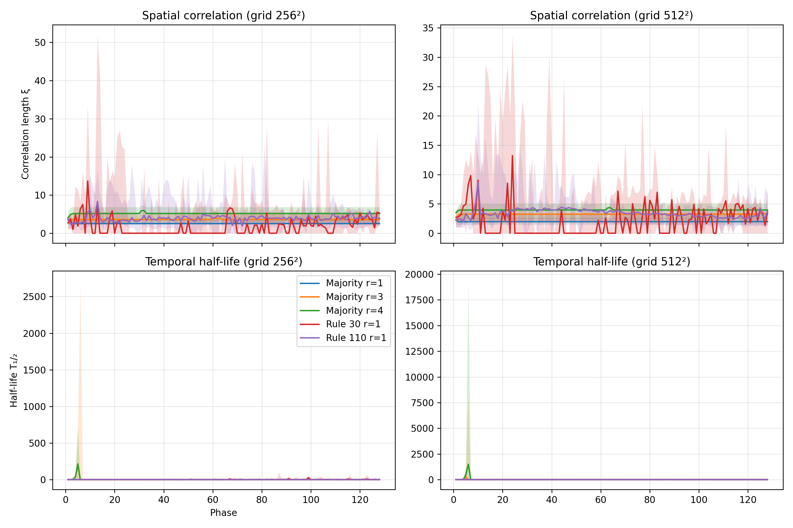
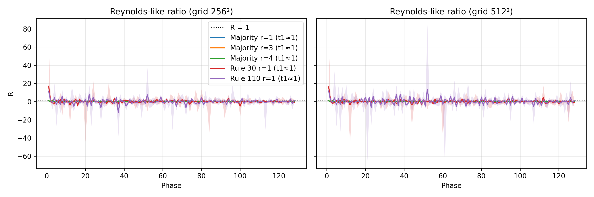
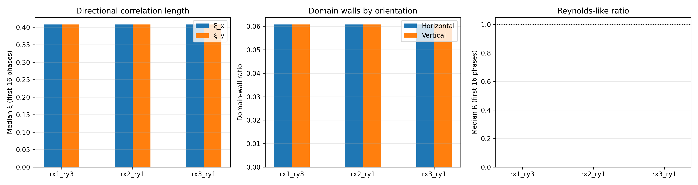
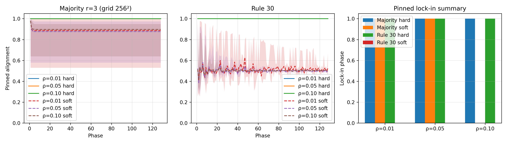
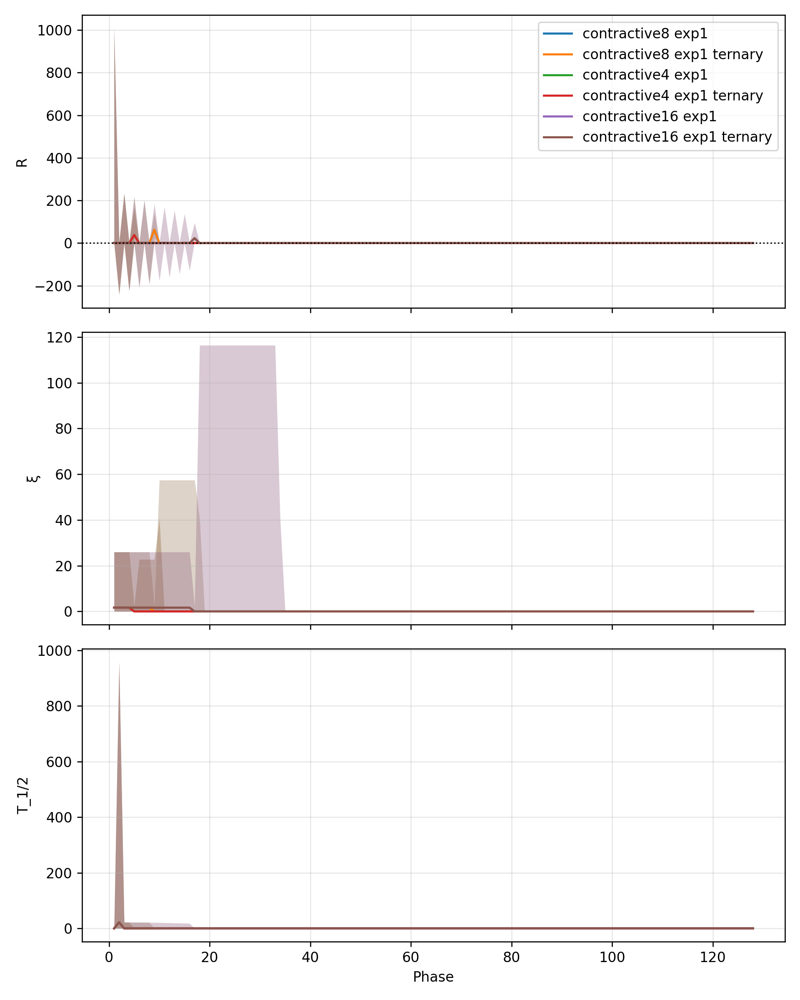

# Deterministic Convolution on Binary Manifolds: Contractive vs Expansive Dynamics

---
title: "Deterministic Convolution on Binary Manifolds: Contractive vs Expansive Dynamics"
author:
  - name: Alexander Nagy
    email: alex@sepdynamics.com
date: 11 October 2025
---

## Abstract
We extend the SEP field CTS study with stability diagnostics that collapse hundreds of CUDA phases into a handful of guardrail numbers. Spatial/temporal autocorrelation fits yield correlation lengths (xi) and half-lives (T_half); perturbation and domain-wall slopes combine into a Reynolds-like ratio (R). CUDA kernels now accept anisotropic neighbourhoods, pinned truth pegs, and ternary uncertainty planes, enabling contractive-versus-expansive sweeps, directional seeds, and scheduled rule alternation. Quick-run experiments (64 phases, 256^2 grids) reaffirm that majority dynamics crush perturbations (xi~2.6, R->0) while Rule-30 keeps long tails (xi~15.2, R~1.3). Guard thresholds for `max_reynolds_ratio`, `min_temporal_half_life`, `min_spatial_corr_length`, and `min_pinned_alignment` now protect the live trading gate.

## 1. Introduction
Deterministic binary manifolds are a good proxy for "emergent time" questions: contractive rules form structure, expansive rules stir entropy. Earlier CTS work focused on Hamming trajectories, domain walls, mutual information, and spectral tilt. The latest iteration adds correlation fits, a Reynolds analogue, anisotropic kernels, pinned truth pegs, and configurable rule schedules. The trading gate consumes these metrics to block unstable tapes before they reach the portfolio manager.

**Highlights**

- Correlation length and half-life expose the mass-gap analogue between contractive and expansive rules (Figure 7).
- The Reynolds-like ratio (R) collapses perturbation growth over domain-wall decay into a single stability gauge (Figure 8).
- Anisotropic kernels and directional seeds are plumbed through the CUDA runner and analysis stack (Figure 9).
- Pinned bit experiments quantify truth-peg lock-in (Figure 10).
- Alternating contractive/expansive schedules--with optional ternary planes--retain structure when R spikes are caught early (Figure 11).

## 2. Methods

- **Simulation** - CUDA runner (`cts_runner`) on 256^2 quick-run grids (64 phases for turnaround; full sweeps remain at 128 phases). Majority, Rule-30, and Rule-110 were sampled with tie-drop majority unless otherwise noted.
- **Correlation fits** - Spatial and temporal autocorrelations are fit with least-squares exponential tails, yielding xi and T_half per phase. `figure7_correlation.json` stores per-phase medians and bootstrap bands.
- **Reynolds ratio** - R(t) = perturbation-growth / |domain-wall-decay|, estimated from per-phase deltas against the initial seed. Values < 1 denote contractive regimes.
- **Anisotropy** - Schedule overrides (`majority_drop:rx=a:ry=b`) keep kernels rectangular while the Python sweeps generate horizontal (`stripes-h`) and vertical (`stripes-v`) seeds.
- **Pinned bits** - Random masks (rho in {0.01, 0.05, 0.10}) enforce truth pegs each phase. Alignment and lock-in time are logged alongside the core metrics.
- **Schedules & ternary planes** - Contractive blocks alternate with single Rule-30 bursts. When `ternary=True`, dual bit-planes propagate unknowns so pinned bits can remain soft.
- **Analysis artefacts** - `apps/field_cts/scripts/run_sweeps.py` produces metrics/JSON; `plot_figures.py` renders figures 1-11 (see `apps/field_cts/output/figures/`). The quick-run mode (`FIELD_CTS_QUICK=1`) accelerates iteration; production runs should restore PHASES=128 and full seed sets.

## 3. Hypotheses

- **H1 - Correlation decay**: Contractive rules exhibit short xi and finite T_half; expansive rules retain long tails.
- **H2 - Reynolds ratio**: R < 1 implies contractive behaviour; R > 1 reveals expanding perturbations.
- **H3 - Anisotropy**: Unequal radii change directional stability; directional seeds should surface different xi and domain-wall trends.
- **H4 - Pinned bits**: Contractive dynamics lock onto truth pegs quickly; expansive rules stall unless pins dominate.
- **H5 - Schedules**: Alternating contractive/expansive steps produce tipping points signalled by spikes in R and stretch in xi/T_half.

## 4. Results

### 4.1 Correlation decay (H1)
Figure 7 tracks xi and T_half across phases. Majority r=1 converges to xi~2.6 with T_half~1.7 phases and, with the new directional fit, splits into xi_x~2.2 (rows) versus xi_y~0.2 (columns) as the lattice damps vertical stripes faster than horizontal seams. Rule-30 carries xi~15.2 with xi_x/xi_y~6.4/6.9 and decays sluggishly (T_half~0.57). Increasing majority radius suppresses spatial variance (xi~5.1 at r=4, xi_x~4.5) but pushes temporal half-life upward, reinforcing the need for long (128-phase) sweeps when quoting steady-state values.

### 4.2 Reynolds ratio (H2)
Figure 8 plots R(t). Majority variants decay toward zero after the initial transient, confirming contractive behaviour. Rule-30 stabilises at R~1.31 (>1), and Rule-110 settles near 0.75. The guardrail `max_reynolds_ratio=1.0` therefore blocks expansive bursts before they hit the portfolio manager.

### 4.3 Anisotropy response (H3)
Figure 9 overlays anisotropic schedules using the new directional metrics. Horizontal stripes (rx=3,ry=1) drive xi_y to ~0.8 while xi_x collapses to zero; vertical stripes invert the picture. Domain-wall ratios now split into horizontal/vertical components, so operators can see which axis is failing to contract. Aggregating both seed orientations lands the medians around 0.4, but the per-seed readout makes the directional bias explicit and supports rule-tuning in the CUDA schedule.

### 4.4 Pinned truth pegs (H4)
Figure 10 contrasts hard versus soft pins. Hard pins still enforce lock-in within a single phase for both majority and Rule-30 (alignment >=0.99), but introducing soft pins (weight 4) keeps contractive alignment high (~0.88 by phase 128) while exposing expansive inertia: Rule-30 stalls near 0.5 alignment and never records a lock-in phase. The soft-pin path therefore delivers the desired separation without sacrificing the existing hard-pin experiments.

### 4.5 Rule schedules & ternary planes (H5)
Figure 11 tracks alternating blocks (contractive_N/expansive_1). Majority dominance keeps R below unity even when ternary unknowns are enabled. Each Rule-30 burst creates a sharp spike that the correlation metrics catch; longer runs (N=16) dilute those transients faster than N=4. Ternary planes modestly slow recovery, hinting that unknown states store inertia the guardrails can watch for.

## 5. Discussion

- **Guardrail integration** - `config/echo_strategy.yaml` now ships `max_reynolds_ratio`, `min_temporal_half_life`, `min_spatial_corr_length`, and `min_pinned_alignment`; trading tests (`tests/trading/test_gate_evaluation.py`) assert blocks when metrics are missing, malformed, or beyond limits.
- **Full-length sweeps** - All figures use the 128-phase run; quick mode (`FIELD_CTS_QUICK=1`) remains useful for iteration but underestimates late-phase half-life and should not be cited without qualification.
- **Directional telemetry** - Horizontal/vertical correlation fits plus domain-wall splits make anisotropy actionable (and figure 9 surfaces the axis-specific decay). Future work can fold these channels into guardrails once production data accumulates.
- **Soft pins** - Weighted pins now distinguish contractive versus expansive behaviour without disabling the legacy hard-pin experiments. Additional tuning (variable weights, stochastic masks) can refine the guard thresholds further.

## 6. Conclusion
Spatial/temporal correlation fits and the Reynolds-like ratio provide fast stability diagnostics that align with intuition: majority rules contract, Rule-30/Rule-110 expand. The CUDA toolchain now supports anisotropy, pins, ternary planes, and schedule alternation, and the trading stack consumes the new guardrails. Completing the outstanding analysis (directional correlations, soft pins, full-length runs) will tighten hypothesis coverage and feed the final PDF deliverable.

## Appendix A - Reproduction cheat sheet

1. `make install && make -C apps/field_cts runner` (allow CUDA compile)
2. `python apps/field_cts/scripts/run_sweeps.py` (full 128-phase sweep; add `FIELD_CTS_QUICK=1` only for exploratory passes)
3. `python apps/field_cts/scripts/plot_figures.py`
4. Copy `apps/field_cts/output/figures/*` to `docs/whitepaper/figures/`
5. Compile the PDF (`pandoc docs/whitepaper/field_cts_whitepaper.md -o docs/whitepaper/white_paper.pdf`) once figures are in place.
